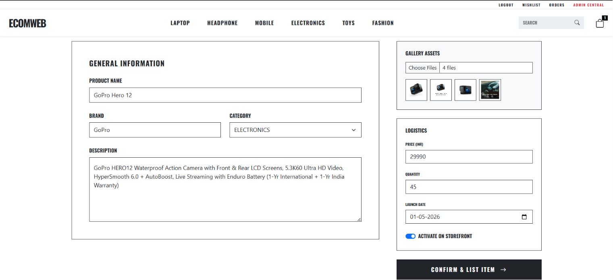
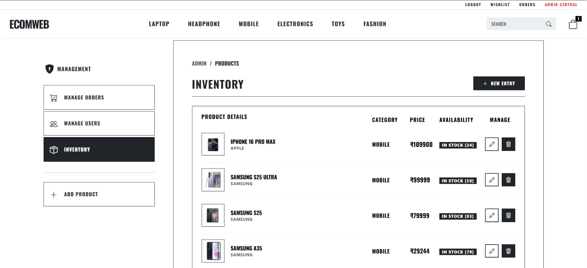
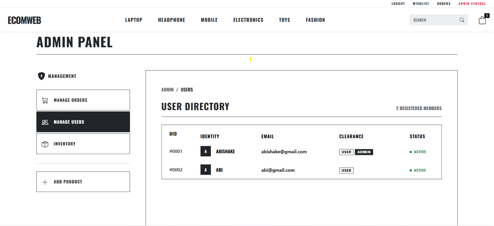
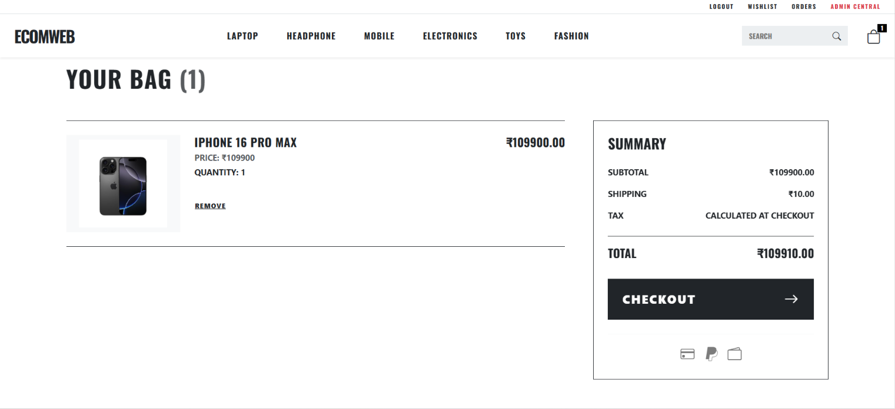
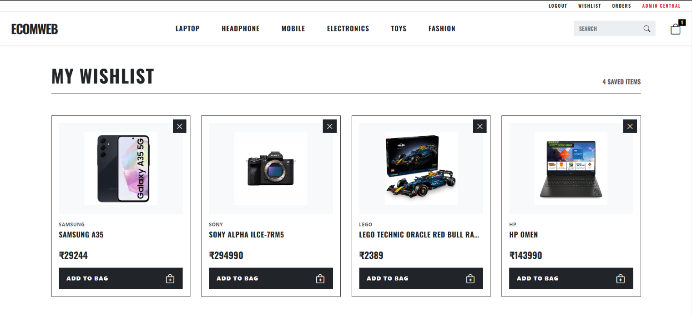
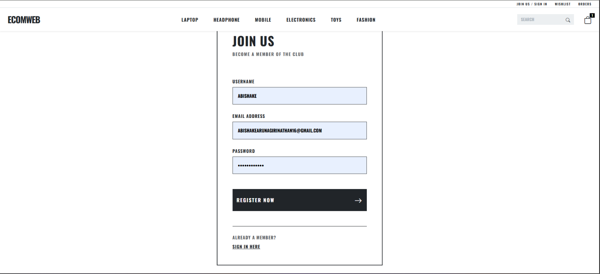
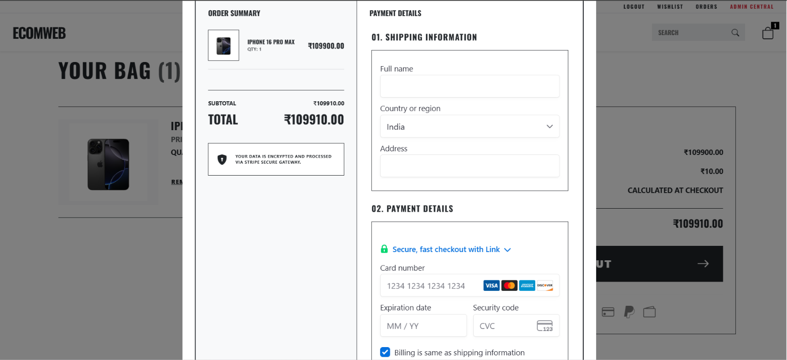

# ECOM-WEB – Full Stack E-Commerce Application

A comprehensive e-commerce web application built with React + Vite (frontend) and Spring Boot (backend). Includes product management, user authentication with JWT, shopping cart, wishlists, order processing, and Stripe payment integration.

## Overview

- **Frontend**: React with Vite, Bootstrap styling
- **Backend**: Spring Boot REST APIs with JWT security and role-based access control
- **Database**: MySQL
- **Payment**: Stripe integration
- **Authentication**: JWT token-based with RBAC

## Features

**User Features**
- User registration and authentication
- Browse and search products with category filtering
- Product details with image gallery
- Shopping cart with quantity management
- Persistent cart storage
- Wishlist functionality
- Order history and tracking

**Admin Features**
- Admin dashboard with control panel
- Product inventory management (CRUD)
- Multi-image product uploads
- Stock quantity tracking
- User management
- Order management and tracking

**Checkout & Payment**
- Secure checkout process
- Stripe payment integration
- Address validation and collection
- Promo code support
- Order confirmation and email notifications

**Security**
- JWT token-based authentication
- BCrypt password encoding
- Role-based access control (ADMIN, MODERATOR, USER)
- Protected API endpoints
- Email and username validation

## Tech Stack

**Frontend**: React 18+, Vite, Bootstrap, Axios, Stripe.js

**Backend**: Java 11+, Spring Boot, Spring Security (JWT), Spring Data JPA, Hibernate, Maven

**Database**: MySQL 5.7+

## Setup Instructions

### Prerequisites
- Java 11 or higher
- Node.js 14+ and npm
- MySQL Server
- Git

### Database Setup

Create the database:
```sql
CREATE DATABASE ecom_web;
```

### Backend Setup

1. Navigate to backend:
```bash
cd backend/ecom-proj
```

2. Configure `src/main/resources/application.properties`:
```properties
spring.datasource.url=jdbc:mysql://localhost:3306/ecom_web
spring.datasource.username=root
spring.datasource.password=your_password
spring.jpa.hibernate.ddl-auto=update
```

3. Run the backend:
```bash
mvn spring-boot:run
```

Backend runs on `http://localhost:8080`

### Frontend Setup

1. Navigate to frontend:
```bash
cd frontend/ecom-frontend-5-main
```

2. Install dependencies:
```bash
npm install
```

3. Start development server:
```bash
npm run dev
```

Frontend runs on `http://localhost:5173`

## API Endpoints

### Authentication
| Method | Endpoint | Description |
|--------|----------|-------------|
| POST | `/api/auth/signup` | Register new user |
| POST | `/api/auth/signin` | User login |

### Products
| Method | Endpoint | Description |
|--------|----------|-------------|
| GET | `/api/products` | Get all products |
| GET | `/api/product/{id}` | Get product details |
| GET | `/api/product/{productId}/image` | Get product image |
| GET | `/api/products/search?keyword={value}` | Search products |
| POST | `/api/product` | Add product (Auth required) |
| PUT | `/api/product/{id}` | Update product (Auth required) |
| DELETE | `/api/product/{id}` | Delete product (Admin only) |

### Wishlist
| Method | Endpoint | Description |
|--------|----------|-------------|
| POST | `/api/wishlist/add/{productId}` | Add to wishlist |
| GET | `/api/wishlist` | Get user's wishlist |
| DELETE | `/api/wishlist/remove/{productId}` | Remove from wishlist |

### Orders
| Method | Endpoint | Description |
|--------|----------|-------------|
| POST | `/api/orders` | Create order (Auth required) |
| GET | `/api/orders/user` | Get user's orders |
| GET | `/api/admin/orders` | Get all orders (Admin only) |

### Payment
| Method | Endpoint | Description |
|--------|----------|-------------|
| POST | `/api/payment/create-payment-intent` | Create Stripe payment intent |

### Admin
| Method | Endpoint | Description |
|--------|----------|-------------|
| GET | `/api/admin/users` | List all users (Admin only) |

## Authentication

JWT token-based authentication with role-based access control (ADMIN, MODERATOR, USER):

1. User authenticates via `/api/auth/signin` or `/api/auth/signup`
2. Server returns JWT token
3. Client includes token in `Authorization: Bearer <token>` header
4. Server validates token before processing request

## Schreenshots

### Home Page


### Product Management



### User Management


### Shopping Features



### Authentication & Payment



## Development

**Frontend Commands**
```bash
npm run dev      # Start development server
npm run build    # Build for production
npm run preview  # Preview build
```

**Backend Commands**
```bash
mvn clean                # Clean build
mvn spring-boot:run      # Run application
mvn test                 # Run tests
```

## Common Issues

**Backend won't start**
- Verify MySQL is running and database exists
- Check database credentials in application.properties
- Ensure Java 11+ is installed

**Frontend won't start**
- Run `npm install` again if dependencies are missing
- Ensure Node.js version is 14+
- Clear npm cache: `npm cache clean --force`

**Database connection error**
- Verify MySQL service is running
- Check database URL and credentials
- Ensure database `ecom_web` exists
